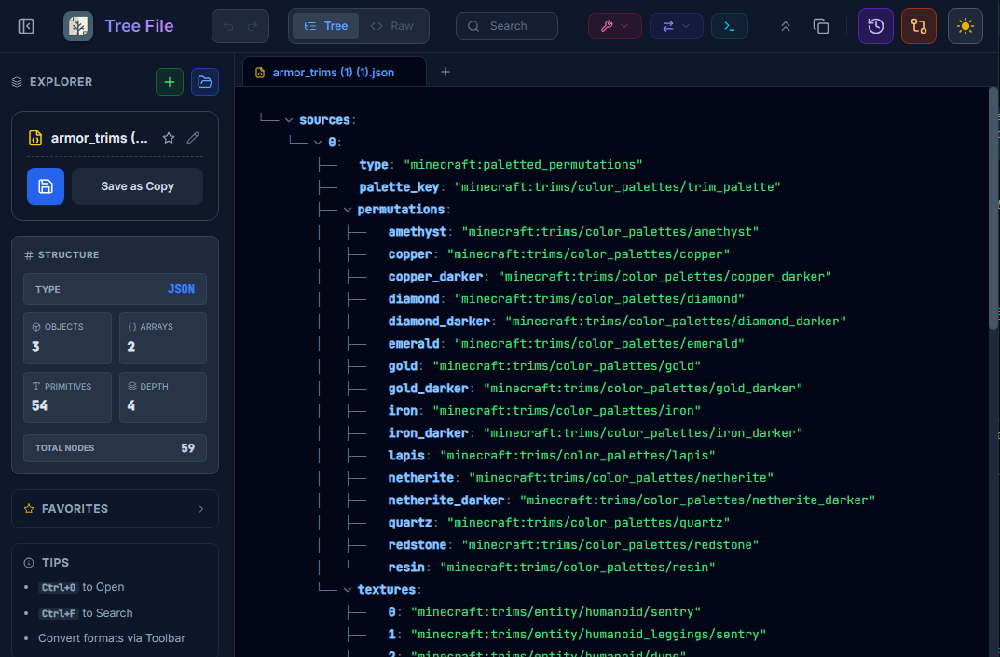

# Tree File 🌳

**Tree File** is a powerful, modern desktop application designed for developers to visualize, edit, and analyze complex data files. Say goodbye to messy raw text—view your data in a clean, interactive tree structure.

*(Tip: Take a screenshot of your app, upload it to the GitHub issue tracker or an image host, and paste the link here)*

## 🚀 Download

**Windows:**
[<kbd>Download for Windows (.exe)</kbd>](https://github.com/lokmanelouk/TreeFile/releases/latest)

---

## ✨ Features

*   **📂 Multi-Format Support:** Open and edit **JSON**, **YAML**, **XML**, and **CSV** files.
*   **🌲 Tree & Raw Views:** Switch instantly between a hierarchical Tree View and a Raw Code Editor.
*   **🔍 Advanced Search:** Search through keys and values deep inside nested structures.
*   **🆚 Diff / Compare:** Upload two files and see the differences side-by-side.
*   **⌨️ Command Palette:** Press `Ctrl+K` to access all tools instantly.
*   **🛠️ Developer Tools:**
    *   Generate **TypeScript Interfaces** from JSON.
    *   **Data Cleanup:** Sort keys, trim strings, and remove nulls.
    *   **Minify & Format** code with one click.
*   **⭐ Favorites & History:** Pin your most-used files and access your full file history.
*   **🎨 Customization:** Dark/Light mode, font sizing, and distinct file type icons.

## 📝 Note on Windows Installation

Since this app is not signed with a paid Microsoft certificate, you might see a **"Windows protected your PC"** popup.
1.  Click **"More Info"**.
2.  Click **"Run Anyway"**.